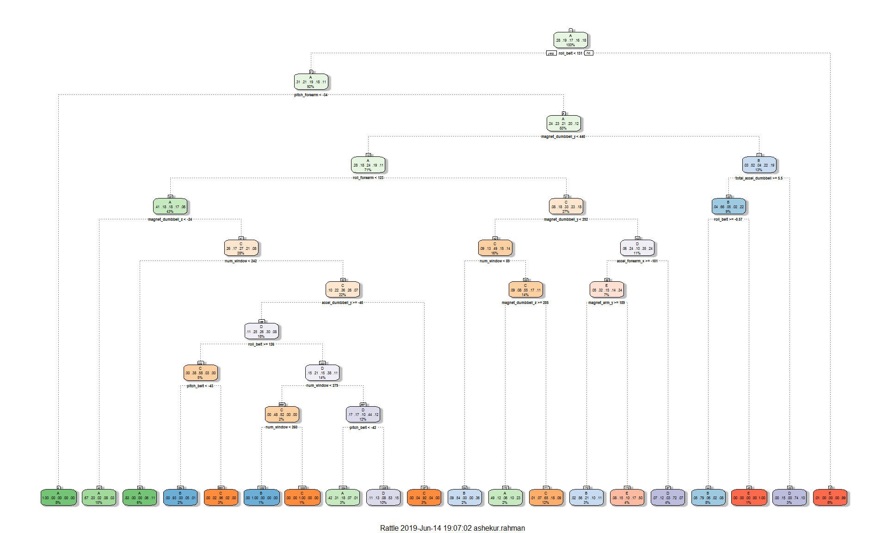

## Overview

The following steps have been taken to complete the project:

1. Loading the Packages
2. Data Loading and Cleaning
3. Exploratory Data Analysis
4. Training Models
5. Prediction Model Selection
6. Prediction on New Dataset

## 1. Loading the Packages

For analyzing the given dataset for this project, the following R packages are needed to load prior running the analysis.


```r
library(lattice)
library(ggplot2)
library(caret)
library(corrplot)
library(rpart)
library(rpart.plot)
library(rattle)
```

## 2. Data Loading and Cleaning

## i. Data Loading

Load the training and test data set after downloading the datasets from the course content and then split the training dataset further into training and test datasets.


```r
setwd("D:/Learning/Coursera/Practical Machine Learning/Week 4/practicalmachinelearning/")
trainURL <- "http://d396qusza40orc.cloudfront.net/predmachlearn/pml-training.csv"
testURL <- "http://d396qusza40orc.cloudfront.net/predmachlearn/pml-testing.csv"

trainingDS <- read.csv(url(trainURL))
testDS <- read.csv(url(testURL))

label <- createDataPartition(trainingDS$classe, p = 0.7, list = FALSE)
train <- trainingDS[label, ]
test <- trainingDS[-label, ]
```

## ii. Data Cleaning

Before proceed further, data cleaning is necessary. In the training dataset, some variables contain a lot of NA, some have nearly zero variance and some are used for identification. Need to remove these type of variables from final features.


```r
label <- apply(train, 2, function(x) mean(is.na(x))) > 0.95
train <- train[, -which(label, label == FALSE)]
test <- test[, -which(label, label == FALSE)]
NZV <- nearZeroVar(train)
train <- train[ ,-NZV]
test <- test[ ,-NZV]
train <- train[ , -(1:5)]
test <- test[ , -(1:5)]
```

Finally, 54 variables are remaining out of 160 variables after data cleaning.

## 3. Exploratory Data Analysis

After cleaning the dataset, the correlation of the variables are as below:


```r
corr <- cor(train[,-54])
corrplot(corr, method = "color", type = "lower", tl.cex = 0.8, tl.col = rgb(0,0,0))
```

<!-- -->

Darker gradient in the above plot shows higher correlation. As number of correlations are few, Princal Component Analysis is not needed here.

## 4. Training Models

Now different machine learning mothods will be implemented to model the training set and model with best accuracy will be chosen to predict the outcome in the testing dataset. The methods are Decision Tree, Random Forest, Generalized Boosted Model and Naive Bayes.

To help to visualize better, a confusion matrix will be plotted at the end of each model.

### a. Random Forest (RM)


```r
set.seed(1833)
control <- trainControl(method = "cv", number = 3, verboseIter=FALSE)
modelRF <- train(classe ~ ., data = train, method = "rf", trControl = control)

predictRF <- predict(modelRF, test)
confMatRF <- confusionMatrix(predictRF, test$classe)
accRF <- confusionMatrix(predictRF, test$classe)$overall['Accuracy']
confMatRF
```

```
## Confusion Matrix and Statistics
## 
##           Reference
## Prediction    A    B    C    D    E
##          A 1673    1    0    0    0
##          B    1 1137    4    0    0
##          C    0    1 1022    4    0
##          D    0    0    0  960    3
##          E    0    0    0    0 1079
## 
## Overall Statistics
##                                          
##                Accuracy : 0.9976         
##                  95% CI : (0.996, 0.9987)
##     No Information Rate : 0.2845         
##     P-Value [Acc > NIR] : < 2.2e-16      
##                                          
##                   Kappa : 0.997          
##                                          
##  Mcnemar's Test P-Value : NA             
## 
## Statistics by Class:
## 
##                      Class: A Class: B Class: C Class: D Class: E
## Sensitivity            0.9994   0.9982   0.9961   0.9959   0.9972
## Specificity            0.9998   0.9989   0.9990   0.9994   1.0000
## Pos Pred Value         0.9994   0.9956   0.9951   0.9969   1.0000
## Neg Pred Value         0.9998   0.9996   0.9992   0.9992   0.9994
## Prevalence             0.2845   0.1935   0.1743   0.1638   0.1839
## Detection Rate         0.2843   0.1932   0.1737   0.1631   0.1833
## Detection Prevalence   0.2845   0.1941   0.1745   0.1636   0.1833
## Balanced Accuracy      0.9996   0.9986   0.9975   0.9976   0.9986
```

### b. Generalized Boosted Model (GBM)


```r
set.seed(1847)
control <- trainControl(method = "repeatedcv", number = 5, repeats = 1, verboseIter = FALSE)
modelGBM <- train(classe ~ ., data = train, trControl = control, method = "gbm", verbose = FALSE)
modelGBM$finalModel
```

```
## A gradient boosted model with multinomial loss function.
## 150 iterations were performed.
## There were 53 predictors of which 53 had non-zero influence.
```

```r
predictGBM <- predict(modelGBM, test)
confMatGBM <- confusionMatrix(predictGBM, test$classe)
accGBM <- confusionMatrix(predictGBM, test$classe)$overall['Accuracy']
confMatGBM
```

```
## Confusion Matrix and Statistics
## 
##           Reference
## Prediction    A    B    C    D    E
##          A 1672   12    0    0    0
##          B    1 1119   10    7    3
##          C    0    7 1010    1    1
##          D    1    1    3  954   11
##          E    0    0    3    2 1067
## 
## Overall Statistics
##                                           
##                Accuracy : 0.9893          
##                  95% CI : (0.9863, 0.9918)
##     No Information Rate : 0.2845          
##     P-Value [Acc > NIR] : < 2.2e-16       
##                                           
##                   Kappa : 0.9865          
##                                           
##  Mcnemar's Test P-Value : NA              
## 
## Statistics by Class:
## 
##                      Class: A Class: B Class: C Class: D Class: E
## Sensitivity            0.9988   0.9824   0.9844   0.9896   0.9861
## Specificity            0.9972   0.9956   0.9981   0.9967   0.9990
## Pos Pred Value         0.9929   0.9816   0.9912   0.9835   0.9953
## Neg Pred Value         0.9995   0.9958   0.9967   0.9980   0.9969
## Prevalence             0.2845   0.1935   0.1743   0.1638   0.1839
## Detection Rate         0.2841   0.1901   0.1716   0.1621   0.1813
## Detection Prevalence   0.2862   0.1937   0.1732   0.1648   0.1822
## Balanced Accuracy      0.9980   0.9890   0.9913   0.9932   0.9925
```

### c. Decision Tree (DT)


```r
set.seed(1671)
modelDT <- rpart(classe ~ ., data = train, method = "class")
fancyRpartPlot(modelDT)
```

<!-- -->

```r
predictDT <- predict(modelDT, test, type = "class")
confMatDT <- confusionMatrix(predictDT, test$classe)
accDT <- confusionMatrix(predictDT, test$classe)$overall['Accuracy']
confMatDT
```

```
## Confusion Matrix and Statistics
## 
##           Reference
## Prediction    A    B    C    D    E
##          A 1512  291   51  117   88
##          B   44  614   81   41   99
##          C    8   60  798  135   77
##          D   89  138   65  626  133
##          E   21   36   31   45  685
## 
## Overall Statistics
##                                          
##                Accuracy : 0.7196         
##                  95% CI : (0.708, 0.7311)
##     No Information Rate : 0.2845         
##     P-Value [Acc > NIR] : < 2.2e-16      
##                                          
##                   Kappa : 0.6428         
##                                          
##  Mcnemar's Test P-Value : < 2.2e-16      
## 
## Statistics by Class:
## 
##                      Class: A Class: B Class: C Class: D Class: E
## Sensitivity            0.9032   0.5391   0.7778   0.6494   0.6331
## Specificity            0.8701   0.9442   0.9424   0.9136   0.9723
## Pos Pred Value         0.7343   0.6985   0.7403   0.5956   0.8374
## Neg Pred Value         0.9577   0.8951   0.9526   0.9301   0.9216
## Prevalence             0.2845   0.1935   0.1743   0.1638   0.1839
## Detection Rate         0.2569   0.1043   0.1356   0.1064   0.1164
## Detection Prevalence   0.3499   0.1494   0.1832   0.1786   0.1390
## Balanced Accuracy      0.8867   0.7416   0.8601   0.7815   0.8027
```

### d. Naive Bayes (NB)


```r
set.seed(1819)
control <- trainControl(method = "repeatedcv", number = 4, repeats = 1, verboseIter = FALSE)
modelNB <- train(classe ~ ., data = train, trControl = control, method = "nb", verbose = FALSE)

predictNB <- predict(modelNB, test)
confMatNB <- confusionMatrix(predictNB, test$classe)
accNB <- confusionMatrix(predictNB, test$classe)$overall['Accuracy']
confMatNB
```

```
## Confusion Matrix and Statistics
## 
##           Reference
## Prediction    A    B    C    D    E
##          A 1530  241  175  151   54
##          B   31  722   71    4  111
##          C   36  113  753  127   41
##          D   71   55   27  648   38
##          E    6    8    0   34  838
## 
## Overall Statistics
##                                           
##                Accuracy : 0.7631          
##                  95% CI : (0.7521, 0.7739)
##     No Information Rate : 0.2845          
##     P-Value [Acc > NIR] : < 2.2e-16       
##                                           
##                   Kappa : 0.6973          
##                                           
##  Mcnemar's Test P-Value : < 2.2e-16       
## 
## Statistics by Class:
## 
##                      Class: A Class: B Class: C Class: D Class: E
## Sensitivity            0.9140   0.6339   0.7339   0.6722   0.7745
## Specificity            0.8525   0.9543   0.9348   0.9612   0.9900
## Pos Pred Value         0.7113   0.7689   0.7037   0.7723   0.9458
## Neg Pred Value         0.9614   0.9157   0.9433   0.9374   0.9512
## Prevalence             0.2845   0.1935   0.1743   0.1638   0.1839
## Detection Rate         0.2600   0.1227   0.1280   0.1101   0.1424
## Detection Prevalence   0.3655   0.1596   0.1818   0.1426   0.1506
## Balanced Accuracy      0.8833   0.7941   0.8343   0.8167   0.8822
```

## 5. Prediction Model Selection

Random forest is the best performing model, followed by Generalized Boosted Model.

## 6. Prediction on New Dataset

Now, Random Forest model will be used for final prediction of the given test dataset.


```r
predictRF <- predict(modelRF, testDS)
predictRF
```

```
##  [1] B A B A A E D B A A B C B A E E A B B B
## Levels: A B C D E
```
